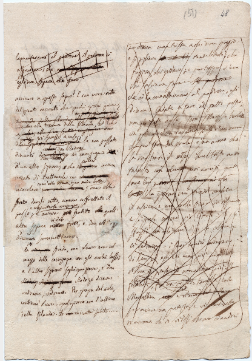
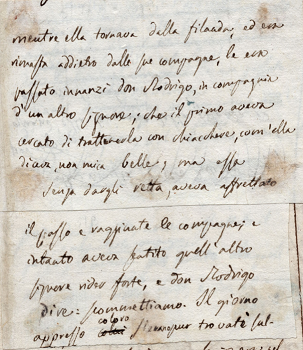
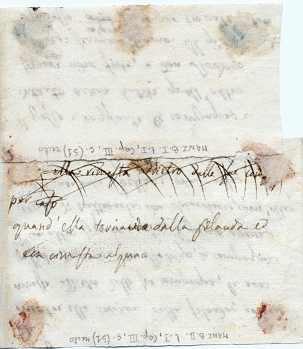
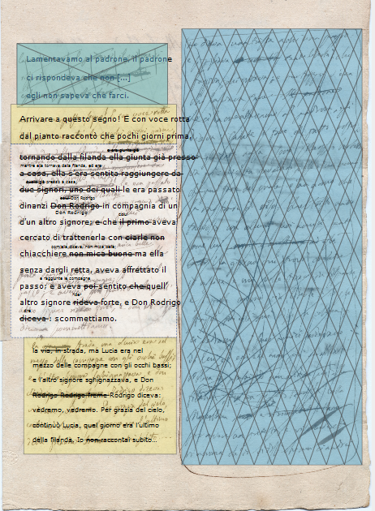
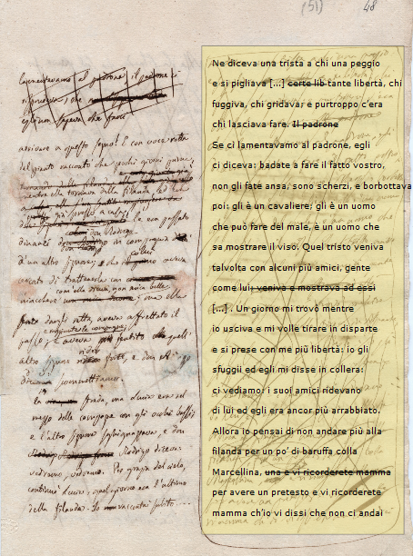

#Struttura del file XML-TEI *codifica_tei_024a_025d*

All’interno del &lt;teiHeader> del file XML codifica_tei_024a_025d, è stato inserito nel &lt;profileDesc> un marcatore &lt;creation> in cui si trovano le specifiche dei quattro &lt;listChange> necessari ad indentificare le varie &lt;zone> del fine con determinati @change. Ognuno ha un @xml:id univoco con i seguenti valori:

1.	writing_sp

2.	writing_fl

3.	reading_sp

4.	reading_fl

Ogni &lt;listChange> contiene i &lt;change> necessari all’interno della codifica. A sua volta ogni &lt;change> è identificato da un @xml:id che sarà richiamato negli attributi @change delle &lt;zone>, e un &lt;desc> nel quale è inserita una breve descrizione.

##Le immagini

Da qui inizia il vero lavoro sui facsimili delle pagine che si presentano come in figura 1. La pagina presa ad esempio è la 51r sulla quale è stato applicato un cartiglio (fig. 2) il cui testo in recto rientra a far parte dell’andamento narrativa; il testo nel verso, invece, anche se rientra nella sequenza compositiva, non fa parte di quella narrativa.

*Figura 1*: Facsimile della pagina 51r.

*Figura 2*: Facsimile del recto del cartiglio alla pagina 51r.

*Figura 3*: Facsimile del verso del cartiglio alla pagina 51r.

Ogni pagina ed ogni cartiglio, all’interno del &lt;sourceDoc>, sono considerate come &lt;surface>, inserite a loro volta in dei &lt;surfaceGrp>. Per richiamarle all’interno della codifica viene utilizzato il marcatore &lt;graphic> e l’attributo @url, seguito da @width e @height che determinano la grandezza in pixel dell’immagine. 

Allo stesso livello del &lt;graphic> abbiamo le &lt;zone>. Queste sono le zone di testo che sono state rintracciate sulla pagina manoscritta. Ogni zona è attribuibile al *Fermo e Lucia*, o agli Sposi promessi o ad entrambi e, una volta effettuata la trasformazione XSLT si presentano come illustrato nelle figure 4 e 5.

*Figura 4*: Visualizzazione (come da ambiente web) delle zone di testo rintracciate per la fase compositiva degli *Sposi Promessi*

*Figura 5*: Visualizzazione (come da ambiente web) delle zone di testo rintracciate per la fase compositiva del *Fermo e Lucia*

I colori di sfondo attribuiti rispondono a diverse necessità: il giallo indica le zone base, ovvero quelle che sono state scritte, o che vanno lette (dipende se ci si trova nell’ordine compositivo o narrativo); il blu evidenzia le zone che sono state rifiutate durante il processo creativo; il bianco con il bordo tratteggiato rappresentano le zone di testo che sono state sostituiti (e quindi rifiutate) da un cartiglio; le zone in rosa (non presenti nel nostro esempio) evidenziano le porzioni di testo del Fermo e Lucia che sono state “accettate” durante la ricomposizione degli Sposi promessi.

Tutte le &lt;zone> hanno diversi attributi, fondamentali sia per il riconoscimento che per il corretto funzionamento delle successive trasformazioni XSLT:

1.	un @xml:id che le identifica e permette di poterle richiamare all’occorrenza;

2.	@n la cui presenza aiuta a ricontrollare che tutte le zone individuate sul facsimile vengano poi riportate nella codifica, senza dimenticare nulla;

3.	le dimensioni della zona che posso essere espresse come un rettangolo individuando le coordinate in alto a sinistra (@ulx e uly) e in basso a destra (@lrx e @lry), oppure come un poligono le cui dimensioni sono espresse nell’attributo @points;

4.	un @change in cui vengono richiamati gli xml:id dei &lt;change> inseriti nel &lt;teiHeader> a seconda delle caratteristiche della zona, che sia essa solo di lettura, solo di scrittura o entrambe;

5.	un attributo @style che contiene le specifiche sulla dimensione del font;

6.	un @rend che specifica la spaziatura tra le righe del testo e la loro distanza dal bordo della zona;

7.	un @corresp utilizzato per richiamare una zona tramite il suo @xml:id quando essa corrisponde ad un cartiglio apposto su una porzione di testo della pagina.

##Le linee 

Come si nota in fig. 1 ogni colonna di testo contiene delle righe: questa divisione è stata resa, in fase di codifica, utilizzando il tag &lt;line> che viene aperto e chiuso in corrispondenza di ogni singola riga. Va però specificato che se questa tecnica ci è utile per rendere fedelmente la posizione del testo manzoniano quando si opera la trasformazione con il file XSLT **xsl_manzoni.xsl**, essa risulta completamente inadeguata quando, con il **file xsl_pulito.xsl**, si intende ricreare un testo di lettura in pulito diviso in paragrafi. Per raggiungere questo obbiettivo è risultato utile inserire, ove necessario e facendo riferimento all’edizione cartacea, un tag &lt;milestone> che determina l’inizio di un paragrafo e la fine del precedente, ed ha come attributi @unit, @type e @xml:id.

##Le correzioni d’autore

All’interno del testo occorrono cambiamenti, immediati o meno, apportati dall’autore: correzioni ed aggiunte, che fanno parte dell’avanzare del processo creativo, sono state rese in due maniere distinte all’interno della codifica.

1.	&lt;del> che identifica le parole cancellate sovraimponendovi una linea, può avere un @type=’gap’ (che viene visualizzato come […]) nel caso in cui la cancellatura sia talmente marcata da impedire la lettura del testo sottostante;

2.	&lt;add> che delinea le aggiunte postume la cui posizione è specificata dall’attributo @place tramite i valori above, below, margin e superimposed

Per le elisioni più estese, come nel caso del totale rifiuto del testo del Fermo e Lucia, è stata adottata un’altra marcatura. Allo stesso livello dei &lt;line> si possono trovare dei &lt;delSpan> che indicano una zona priva di testo nella quale è stata inserita una cancellatura che la interessa tutta o in gran parte. Attraverso l’attributo @rend è viene specificata la forma di questa cancellatura, sia essa un cross, delle multiple crosses o una semplice horizontal line. Come sotto elemento c’è un &lt;anchor> che determina il punto di ancoraggio, indentificato con @xml:id, che verrà richiamato nel &lt;delSpan> all’interno dell’attributo @spanTo.

##Attrbuire una zona a fl e sp

Come anticipato nella sezione sulla codifica delle immagini, all’interno dei &lt;zone> abbiamo l’attributo @change all’interno del quale vengono richiamati gli @xml:id dei &lt;change> codificati all’interno del &lt;teiHeader>. Questa operazione permette di identificare ogni zona come appartenente a fl (*Fermo e Lucia*) o a sp (*Sposi promessi*), in modo tale che con la successiva applicazione del Javascript, esse possano apparire cliccando sull’immagine, dopo aver scelto quale dei due testi si vuole visualizzare. I valori affidati a @change, possono appartenere ad una sola lista o a due e, in questo secondo caso, devono essere necessariamente separati da uno spazio. 

